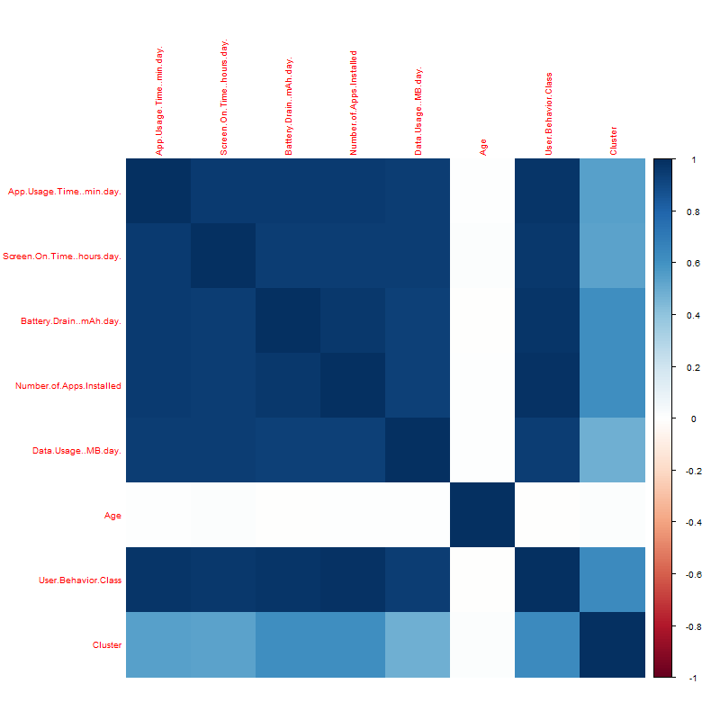
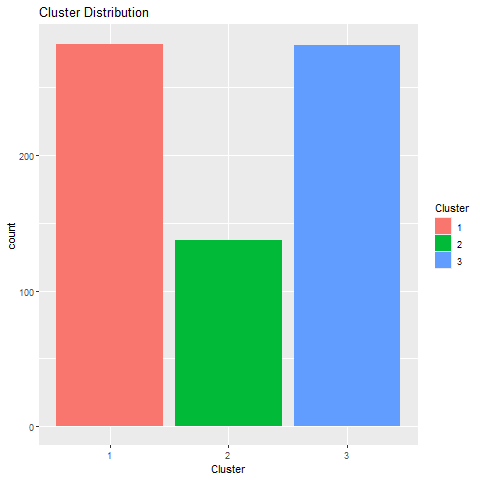
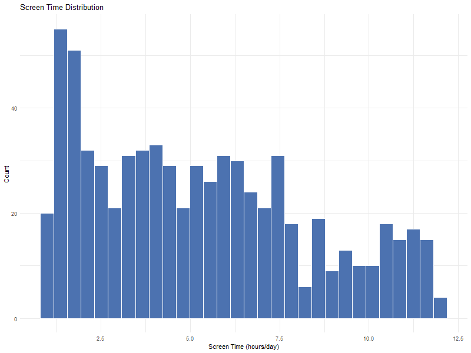
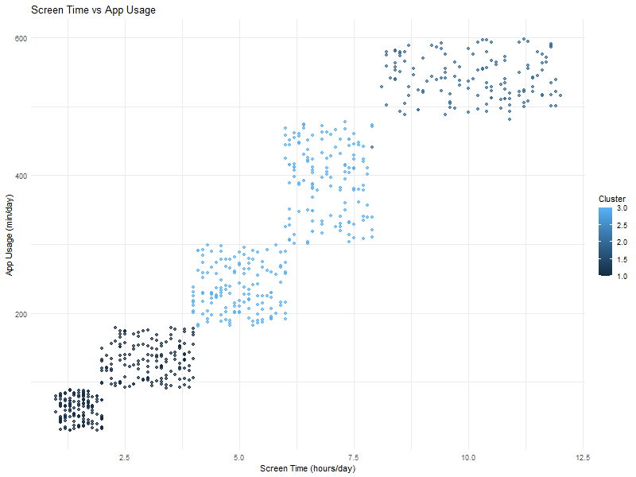
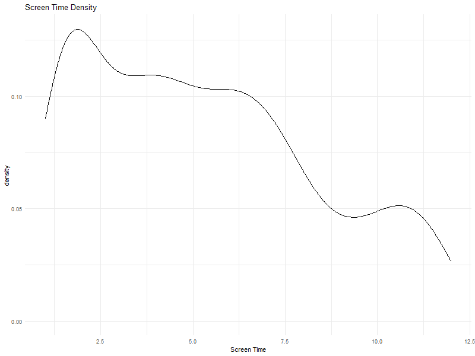
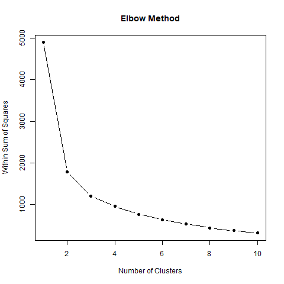
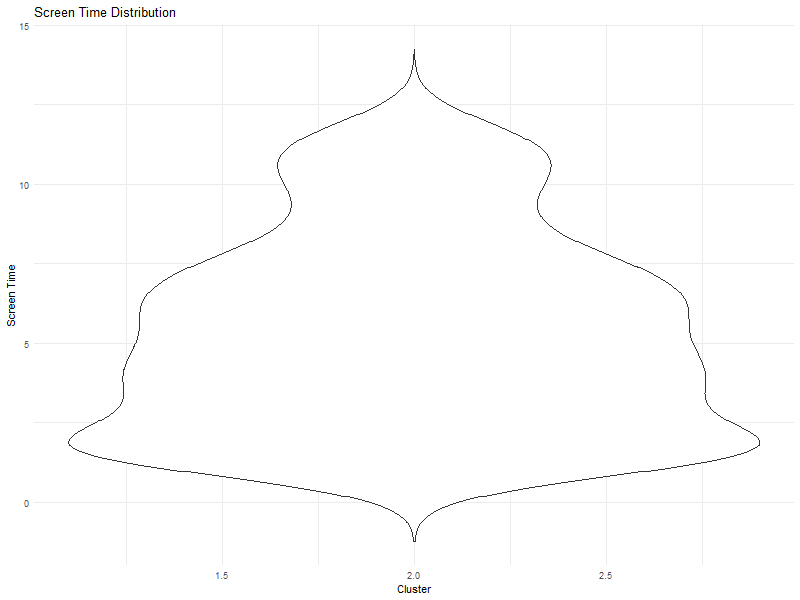
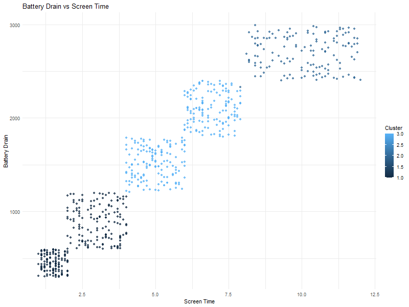

# 📱 Smartphone Behavior Analysis using Data Mining

## 👥 Team Members

| Name | Roll Number |
|------|-------------|
| Bichu Devnarayan | 2023BCS0102 |
| Ravishankar R | 2023BCS0015 |
| Aswin Parames | 2023BCD0024 |
| Abin V Tomy | 2023BCS0084 |

---

## 🎯 Problem Statement

With the rapid increase in smartphone usage, large volumes of behavioral data are generated daily. This project aims to analyze smartphone usage patterns and uncover meaningful behavioral groups and relationships using data mining techniques. By applying clustering and extensive exploratory analysis, we seek to understand how different user groups interact with their smartphones in terms of screen time, app usage, battery consumption, and data usage.

---

## 🎯 Objectives

- Identify distinct user behavior groups using unsupervised clustering (K-Means)
- Discover correlations and relationships between smartphone usage features
- Perform comprehensive exploratory data analysis (EDA) on behavioral attributes
- Visualize behavioral patterns using multiple graphical techniques
- Provide interpretable insights into digital habits and usage trends

---

## 📊 Dataset

- **Source:** [Kaggle – Mobile Device Usage and User Behavior Dataset](https://www.kaggle.com/datasets/valakhorasani/mobile-device-usage-and-user-behavior-dataset)
- **File:** `data/user_behavior_dataset.csv`
- **Number of Observations:** 700
- **Number of Variables:** 11

### Variable Descriptions

| Variable | Description |
|----------|-------------|
| User ID | Unique identifier for each user (removed during preprocessing) |
| Device Model | Smartphone model used (e.g., Google Pixel 5, OnePlus 9) |
| Operating System | Mobile OS (Android / iOS) |
| App Usage Time (min/day) | Daily time spent using apps in minutes |
| Screen On Time (hours/day) | Daily screen-on duration in hours |
| Battery Drain (mAh/day) | Daily battery consumption in mAh |
| Number of Apps Installed | Total number of apps installed on the device |
| Data Usage (MB/day) | Daily mobile data consumption in MB |
| Age | Age of the user |
| Gender | Gender of the user (Male / Female) |
| User Behavior Class | Categorical label indicating usage intensity (1–5) |

---

## ⚙️ Methodology

### 🔹 1. Data Preprocessing (`scripts/01_data_preparation.R`)

- Loaded and inspected the raw dataset
- Performed missing value analysis — **no missing values** were found
- Detected and removed outliers using the **IQR method** on `Screen On Time`
- Converted categorical variables (`Gender`, `Operating System`, `Device Model`) to factors
- Removed the irrelevant `User ID` column
- Converted `User Behavior Class` to a factor variable
- Saved the cleaned dataset to `data/cleaned_data.csv`

### 🔹 2. Exploratory Data Analysis (`scripts/02_exploratory_analysis.R`)

- Distribution analysis using **histograms** for `Screen On Time`
- **Correlation heatmap** to identify linear relationships between numeric features
- **Scatter plot** of screen time vs app usage time
- **Pair plot** for multi-dimensional feature analysis
- Outputs saved to `results/figures/`

### 🔹 3. Clustering – K-Means (`scripts/03_modeling.R`)

- Selected only numeric features and applied **Z-score standardization**
- Determined the optimal number of clusters using the **Elbow Method** (WSS plot)
- Applied **K-Means clustering** with `k=3` and 25 random starts (`nstart=25`)
- Assigned cluster labels to each user and saved to `data/clustered_data.csv`
- Generated cluster-wise feature summaries in `results/tables/cluster_summary.csv`
- Outputs saved to `results/figures2/`

### 🔹 4. Advanced Evaluation & Visualization (`scripts/04_evaluation.R`)

- **Histograms** for app usage, age, and data usage distributions
- **Boxplots** and **violin plots** for screen time spread across clusters
- **Bar charts** for categorical variable distributions (gender, OS, behavior class)
- **Cluster vs category** composition plots (cluster by gender, OS, behavior class)
- **Scatter plots** with cluster color-coding (screen vs app, battery vs screen, apps vs data)
- **Density plots** showing per-cluster screen time distribution
- **Pair plot** on the full post-clustering numeric features
- Outputs saved to `results/figures3/`

---

## 📈 Results

### Clustering Insights

| Cluster | Characteristics | User Type |
|---------|-----------------|-----------|
| Cluster 1 | High screen time, high app usage, high battery drain | **Heavy Users** |
| Cluster 2 | Moderate screen time and app usage | **Balanced Users** |
| Cluster 3 | Low screen time, low app usage, low data consumption | **Minimal Users** |

### Behavioral Patterns Discovered

- **Strong positive correlation** between screen time and app usage time
- **Higher screen time** directly leads to increased battery consumption
- **Users with more apps installed** tend to consume significantly more mobile data
- Behavioral class labels align well with the discovered K-Means clusters
- Clear separation exists between user groups across multiple features

---

## 📊 Key Visualizations

### Correlation Heatmap


### Cluster Distribution


### Screen Time Distribution


### Screen Time vs App Usage (by Cluster)


### Screen Time Density by Cluster


### Elbow Method (Optimal k)


### Screen Time Violin Plot by Cluster


### Battery Drain vs Screen Time


---

## 🚀 How to Run the Project

### Prerequisites

- R (version 4.0 or higher)
- RStudio (recommended)

### Step 1 – Install Required Packages

```r
source("requirements.R")
```

### Step 2 – Place the Dataset

Ensure `user_behavior_dataset.csv` is present in the `data/` folder.

### Step 3 – Run Scripts in Order

```r
source("scripts/01_data_preparation.R")   # Data cleaning and preprocessing
source("scripts/02_exploratory_analysis.R") # Initial EDA plots
source("scripts/03_modeling.R")            # K-Means clustering
source("scripts/04_evaluation.R")          # Advanced evaluation and visualization
source("scripts/05_export_plotly.R")       # Interactive plotly exports (optional)
```

### Step 4 – View Results

All output is saved automatically:

```
results/
├── figures/        # Basic EDA plots (histograms, boxplots, correlation, scatter)
├── figures2/       # Clustering plots (elbow, cluster distribution, feature by cluster)
├── figures3/       # Advanced evaluation plots (violin, density, categorical analysis)
└── tables/
    └── cluster_summary.csv   # Mean feature values per cluster
```

### Optional – Run the Interactive Shiny Dashboard

```r
shiny::runApp("dashboard_shiny/app.R")
```

### Folder Organization

```
SmartphoneBehavior_Team8/
├── data/
│   ├── user_behavior_dataset.csv   # Raw dataset
│   ├── cleaned_data.csv            # After preprocessing
│   └── clustered_data.csv          # After clustering
├── scripts/
│   ├── 01_data_preparation.R
│   ├── 02_exploratory_analysis.R
│   ├── 03_modeling.R
│   ├── 04_evaluation.R
│   └── 05_export_plotly.R
├── results/
│   ├── figures/
│   ├── figures2/
│   ├── figures3/
│   └── tables/
├── dashboard_shiny/
│   └── app.R
├── requirements.R
└── README.md
```

---

## 📌 Conclusion

This project successfully identifies meaningful behavioral patterns in smartphone usage data. K-Means clustering with `k=3` reveals three clearly differentiated user groups — heavy, balanced, and minimal users — each showing consistent patterns across screen time, app usage, battery drain, and data consumption. The extensive visualization suite validates these groupings and provides actionable insights into digital habits and usage trends. These findings can serve as a foundation for personalized digital wellness recommendations and targeted app optimization strategies.

---

## 👨‍💻 Contribution

| Roll Number | Contribution |
|-------------|--------------|
| 2023BCS0102 (Bichu Devnarayan) | Data preprocessing, initial visualization, EDA |
| 2023BCS0015 (Ravishankar R) | Model development (K-Means), evaluation, hyperparameter tuning |
| 2023BCD0024 (Aswin Parames) | Visualization, advanced plots, report writing |
| 2023BCS0084 (Abin V Tomy) | Model integration, Shiny app development, documentation |

---

## 🔗 GitHub Repository

https://github.com/Bichu0077/SmartphoneBehavior_Team8

---

## 📚 References

- Kaggle – Mobile Device Usage and User Behavior Dataset: https://www.kaggle.com/datasets/valakhorasani/mobile-device-usage-and-user-behavior-dataset
- R Core Team (2023). *R: A Language and Environment for Statistical Computing*. R Foundation for Statistical Computing.
- MacQueen, J. (1967). Some Methods for Classification and Analysis of Multivariate Observations. *Proceedings of the 5th Berkeley Symposium on Mathematical Statistics and Probability*.
- Wickham, H. (2016). *ggplot2: Elegant Graphics for Data Analysis*. Springer-Verlag New York.
- Wei, T. & Simko, V. (2021). *corrplot: Visualization of a Correlation Matrix*. R package.
- Chang, W. et al. (2023). *shiny: Web Application Framework for R*. R package.
